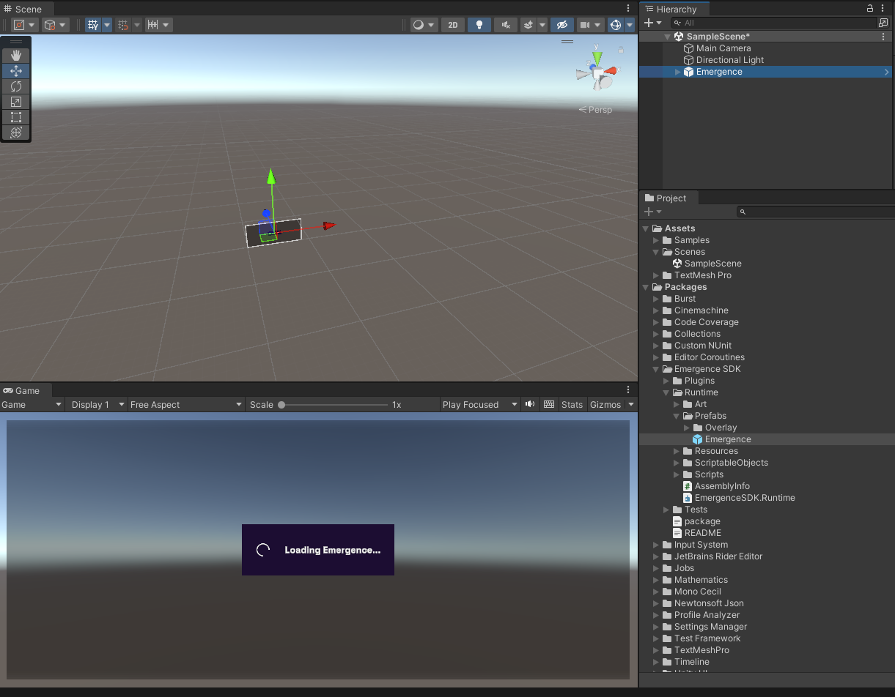

# Getting Started

## Supported Versions

Currenlty supported versions include:

* 2021 LTS
* 2022 LTS

## Installation

Emergence can be installed directly from the Unity asset store. If you're unfamiliar with using the Unity asset store check out these two links from Unity's own documentation:

* [What is the Asset Store and how do I use it?](https://support.unity.com/hc/en-us/articles/210142503-What-is-the-Unity-Asset-Store-and-how-do-I-purchase-Assets-)
* [How do I download an Asset from the Asset Store?](https://support.unity.com/hc/en-us/articles/210112873-How-do-I-download-an-asset-I-have-purchased-)

## Integrating with your game

### The Emergence prefab

Adding Emergence to your game is as simple as dropping the Emergence prefab into the first scene where you want it to appear.

<figure><figcaption></figcaption></figure>

Once it is loaded, the Emergence plugin will be accessible from the rest of your game. It will not unload with scene changes, so it will not lose the instance or any connections it may have.

## The Emergence Prefab

The Emergence prefab has a number of exposed functionalities to look into:

<figure><figcaption></figcaption></figure>

* Configuration & Environment: The configuration is a topic in and of itself, for this Getting Started page we can leave the configuration on Default and Environment on Staging
  * Staging is identical to production with a separate database, it is a risk free environment to develop and test in.
  * See the configuration page for more details.
* Keyboard Shortcut: This will change what to press to open the overlay, the two modifiers when enabled determine what keys need to be pressed in addition to the key.
* Events: There are 2 events, and both are self explanatory, they are called when the user opens or closes the UI.
* Debug Configuration: Log Level allows you to set the verbosity of Emergence Logs. Enabling different log levels to be visible in console. The Debug Overlay key will overlay Debug information in your Game mode display when pressed.
* Default Login Flow: Which system to route Wallet Login through, curently Wallet Connect and Futurepass are supported.
* QR Code Timeout: How long a QR code is valid on teh emergence overlay.

