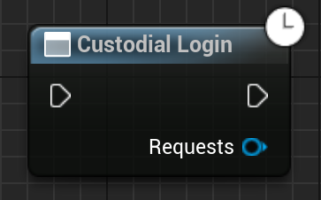

Begins a Futurepass custodial web login by opening the user's browser. When they complete this, GetSubsystem<UEmergenceSingleton>()->OnLoginFinished will be called.

# Inputs

None.

# Outputs

None directly. You can listen for a success or fail with `GetSubsystem<UEmergenceSingleton>()->OnLoginFinished`.

# C++
Module: `EmergenceBlockchainWallet`
include: `#include "WebLogin/CustodialLogin.h"`

`static UCustodialLogin* CustodialLogin(const UObject* WorldContextObject)` - instantiates this async method.
`Activate()` - Activates this async method.

# Additional Information

This class or its parent class inherits from `UEmergenceCancelableAsyncBase`, and thefore also has the following functions that can be called on it:

`void Cancel()` - Cancels the requests.

`bool IsActive()` - Checks if the requests are in-flight.