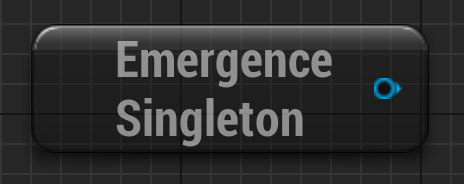
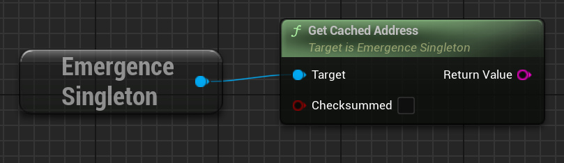
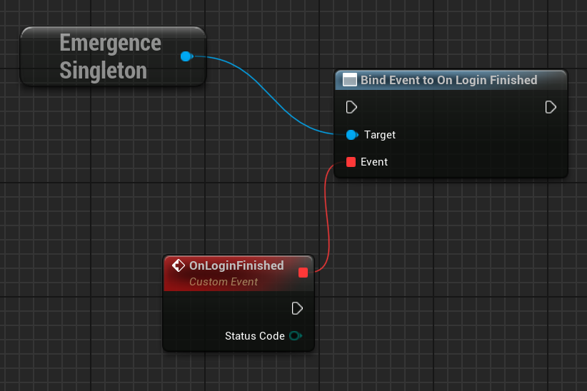
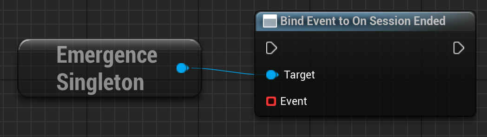
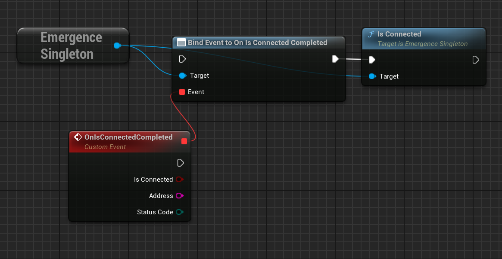
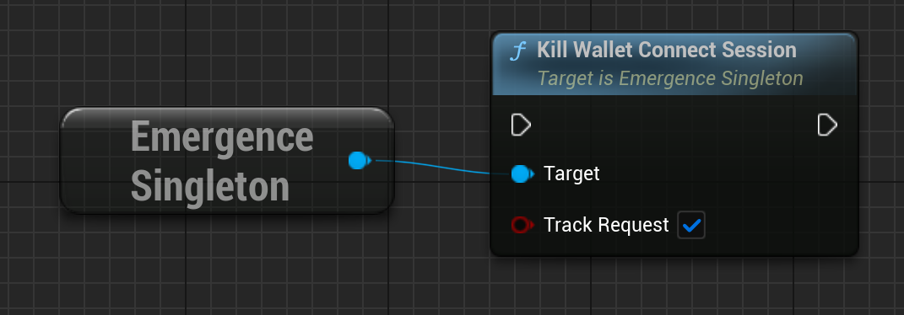
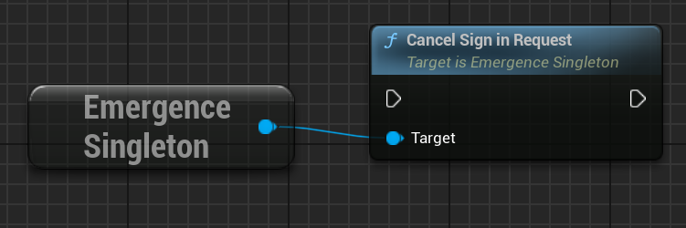

A GameInstance Subsystem for handling user logins with WalletConnect or the Futureverse Custodial Web Login system.
To find it, simply search `Get EmergenceSingleton` in the blueprints. In C++, call `GetWorld()->GetGameInstance()->GetSubsystem<UEmergenceSingleton>()`.

Module: `EmergenceBlockchainWallet`
include: `#include "EmergenceSingleton.h"`

# General

The following methods are used by both WalletConnect and the Futureverse Custodial Web Login system.

## GetCachedAddress

Returns the last wallet connected address. If we don't have one yet, returns "" (empty string).

`FString GetCachedAddress(bool Checksummed = false)`

### Inputs

| - | - | - |
|Type|Name|Description|
|bool|Checksummed|If this is false, the address will be in lower-case, which is the format generally used in Emergence. If it is true, it will be in Ethereum address checksum case, which some other services perfer.|

### Outputs 

| - | - | - |
|Type|Name|Description|
|FString|Return Value|The logged in user's address, or an empty string if they aren't logged in.|

## OnLoginFinished

Event Dispatcher (dynamic multicast delegate) called when the user has done the last step of a login process (either WalletConnect / Futureverse Custodial), or the process has had an error that causes it to finish.

`FOnLoginFinished OnLoginFinished`

### Outputs 

| - | - | - |
|Type|Name|Description|
|EErrorCode|StatusCode|Any erorrs that occurred during the login process. The errors that can occur depend on the type of login.|

## OnSessionEnded

Event Dispatcher (dynamic multicast delegate) called when a WalletConnect / Futureverse Custodial session ends (for example, the user logs out).

`FOnSessionEnded OnSessionEnded`

# WalletConnect Only

## IsConnected

Event Dispatcher (dynamic multicast delegate) checks if a walletconnect session is still valid.

`FOnIsConnectedCompleted OnIsConnectedCompleted`

### Outputs 

| - | - | - |
|Type|Name|Description|
|bool|IsConnected|If the user is connected with WalletConnect.|
|FString|Address|The WalletConnect'd user's address.|
|EErrorCode|StatusCode|Any erorrs that occurred.|

## KillWalletConnectSession

Kills the walletconnect session. Setting TrackRequest to false will mean OnSessionEnded will never fire, and this request won't be added to ActiveRequests (good to prevent this getting premptively killed going from PIE back to Editor.

`void KillWalletConnectSession(bool TrackRequest = true)`

### Inputs

| - | - | - |
|Type|Name|Description|
|bool|TrackRequest|Setting TrackRequest to false will mean OnSessionEnded will never fire, and this request won't be added to ActiveRequests (good to prevent this getting premptively killed going from PIE back to Editor.|

## CancelSignInRequest

Cancels any open WalletConnect "GetHandshake" requests, which are spawned by the WalletConnect Widget.

`void CancelSignInRequest()`