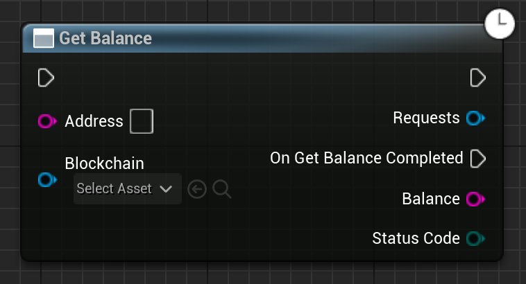

Gets the balance of the given address.

# Inputs

| - | - | - |
|Type|Name|Description|
|UObject\*|WorldContextObject|The WorldContextObject for this function. This is mainly used for registering the async method with the GameInstance.|
|FString|Address|Address to get the balance of.|
|UEmergenceChain\*|Blockchain|Blockchain to get the balance on.|

# Outputs

| - | - | - |
|Type|Name|Description|
|FString|Balance|The balance of this address in Wei.|
|EErrorCode|StatusCode|Any errors that occured trying to get the data.|

# C++
Module: `EmergenceBlockchainWallet`
include: `#include "WalletService/GetBalance.h"`

`UGetBalance::GetBalance()` - instantiates this async method.
`Activate()` - Activates this async method.
In C++, the outputs of the async function can be acted upon by binding to the event delegate "`OnGetBalanceCompleted`".

# Additional Information

This class or its parent class inherits from `UEmergenceCancelableAsyncBase`, and thefore also has the following functions that can be called on it:

`void Cancel()` - Cancels the requests.

`bool IsActive()` - Checks if the requests are in-flight.