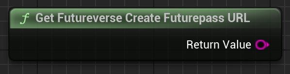

The URL to send the user to to create a futurepass depending on environment

# Inputs

None.

# Outputs

| - | - | - |
|Type|Name|Description|
|FString|Return Value|The URL users should be sent to when they log in with WalletConnect, but don't have a futurepass. This depends on what Futureverse environment you're currently using in the plugin settings.|

# C++
Module: `EmergenceBlockchainWallet`
include: `#include "FutureverseEnvironmentLibrary.h"`

`static FString GetFutureverseCreateFuturepassURL()`