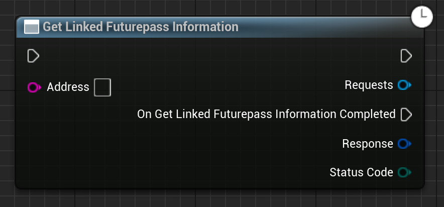

Given a wallet address, gets any linked futurepass information relevent for this wallet.

# Inputs

| - | - | - |
|Type|Name|Description|
|UObject\*|WorldContextObject|The WorldContextObject for this function. This is mainly used for registering the async method with the GameInstance.|
|FString|Address|The address to find a linked futurepass for. This is usually the user's Ethereum address.|

# Outputs

| - | - | - |
|Type|Name|Description|
|FLinkedFuturepassInformationResponse|Response|any linked futurepass information relevent for this wallet|
|EErrorCode|StatusCode|Any errors that occured trying to get the data.|

# C++
Module: `EmergenceBlockchainWallet`
include: `#include "Futurepass/GetLinkedFuturepassInformation.h"`

`static UGetLinkedFuturepassInformation* GetLinkedFuturepassInformation(UObject* WorldContextObject, FString Address)` - instantiates this async method.
`Activate()` - Activates this async method.
In C++, the outputs of the async function can be acted upon by binding to the event delegate "`OnGetLinkedFuturepassInformationCompleted`".

# Additional Information

This class or its parent class inherits from `UEmergenceCancelableAsyncBase`, and thefore also has the following functions that can be called on it:

`void Cancel()` - Cancels the requests.

`bool IsActive()` - Checks if the requests are in-flight.