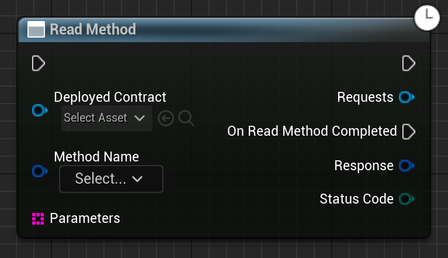

Calls a "read" method on the given contract.

# Inputs

| - | - | - |
|Type|Name|Description|
|UObject\*|WorldContextObject|The WorldContextObject for this function. This is mainly used for registering the async method with the GameInstance.|
|UEmergenceDeployment\*|DeployedContract|The deployed contract.|
|FEmergenceContractMethod|MethodName|The method to call.|
|TArray<FString>|Parameters|The parameters to call the method with.|

# Outputs

| - | - | - |
|Type|Name|Description|
|FJsonObjectWrapper|Response|The response Json object.|
|EErrorCode|StatusCode|Any errors that occured trying to get the data.|

# C++
Module: `EmergenceBlockchainWallet`
include: `#include "WalletService/ReadMethod.h"`

`static UReadMethod* ReadMethod(UObject * WorldContextObject, UEmergenceDeployment* DeployedContract, FEmergenceContractMethod MethodName, TArray<FString> Parameters)` - instantiates this async method.
`Activate()` - Activates this async method.
In C++, the outputs of the async function can be acted upon by binding to the event delegate "`OnReadMethodCompleted`".

# Additional Information

This class or its parent class inherits from `UEmergenceCancelableAsyncBase`, and thefore also has the following functions that can be called on it:

`void Cancel()` - Cancels the requests.

`bool IsActive()` - Checks if the requests are in-flight.