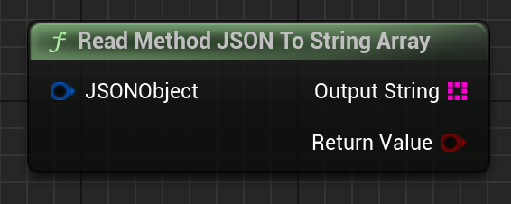

Returns the ReadMethod's wrapped JSON array as a array of strings. "Return Value" is if it was a success.

# Inputs

| - | - | - |
|Type|Name|Description|
|FJsonObjectWrapper|JSONObject|JSONObject to turn into a string.|

# Outputs

| - | - | - |
|Type|Name|Description|
|bool|Return Value|If it was able to turn it into a string.|
|TArray<FString>&|OutputString|The returned array of strings.|

# C++
Module: `EmergenceBlockchainWallet`
include: `#include "WalletService/EmergenceJSONHelpers.h"`

`static bool ReadMethodJSONToStringArray(FJsonObjectWrapper JSONObject, TArray<FString>& OutputString)` - instantiates this method.