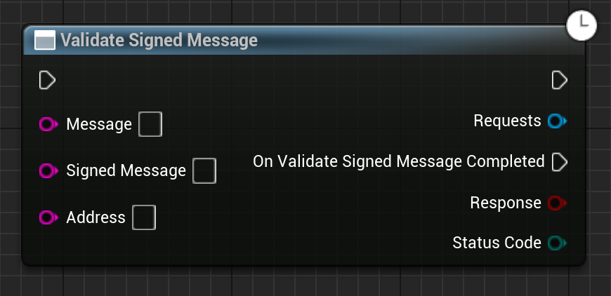

Validates a signed message. Usually used server-side to authenticate player's messages.

# Inputs

| - | - | - |
|Type|Name|Description|
|UObject\*|WorldContextObject|The WorldContextObject for this function. This is mainly used for registering the async method with the GameInstance.|
|const FString&|Message|The original message.|
|const FString&|SignedMessage|The signed message that we want to check.|
|const FString&|Address|The address that signed the message.|

# Outputs

| - | - | - |
|Type|Name|Description|
|bool|Response|If the signed message was signed by the given address, and it was the message that we suspected it was.|
|EErrorCode|StatusCode|Any errors that occured trying to get the data.|

# C++
Module: `EmergenceBlockchainWallet`
include: `#include "WalletService/ValidateSignedMessage.h"`

`UValidateSignedMessage::ValidateSignedMessage()` - instantiates this async method.
`Activate()` - Activates this async method.
In C++, the outputs of the async function can be acted upon by binding to the event delegate "`OnValidateSignedMessageCompleted`".

# Additional Information

This class or its parent class inherits from `UEmergenceCancelableAsyncBase`, and thefore also has the following functions that can be called on it:

`void Cancel()` - Cancels the requests.

`bool IsActive()` - Checks if the requests are in-flight.