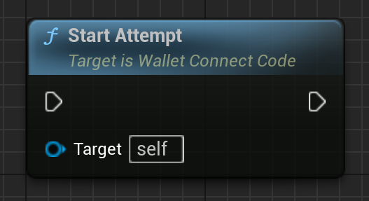
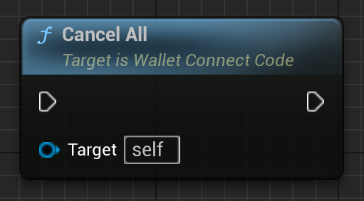
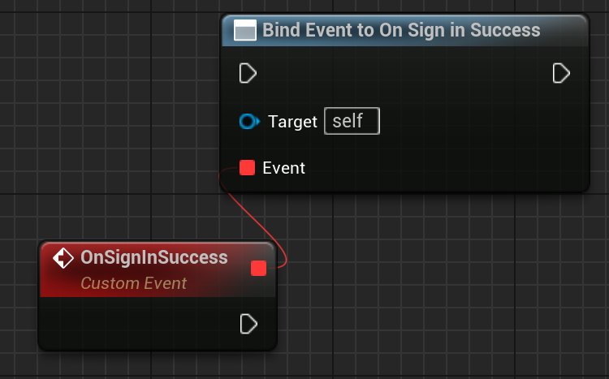
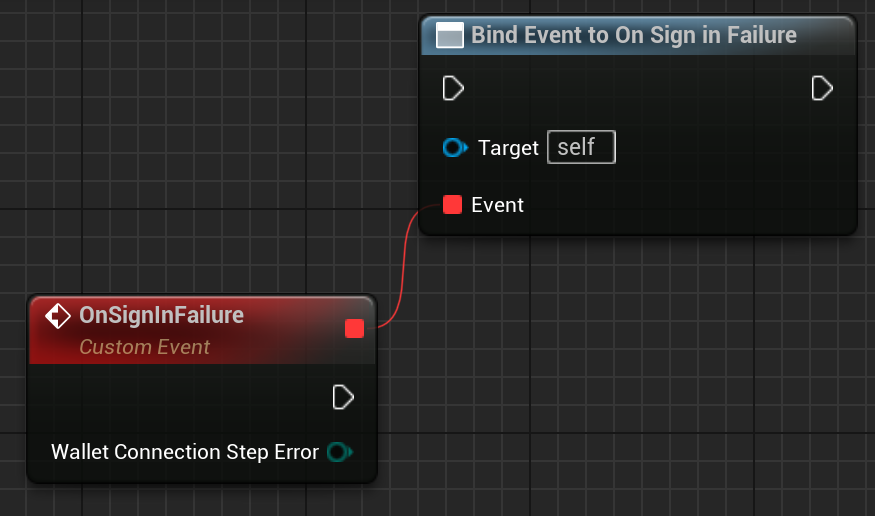

A UMG Widget which can be used to show the user a WalletConnect QR code. 
It also handles getting a plaintext WalletConnect URI, should you also need to show that to a user.
Additionally, it shows how long is left for the user to scan the QR code (as Emergence WalletConnect sessions must be connected to within a time limit, while they are valid).

Module: `EmergenceBlockchainWallet`
include: `#include "WalletConnectCode.h"`

### Properties

| - | - | - |
|Type|Name|Description|
|int|ConnectionRefreshTime|How long before the QR code / WalletConnect URI changes. This can be modified if users are struggling to login in the time provided. It is important to allow the login attempt to reset eventually, just in case the login gets into a "stuck state" for whatever reason. Note: this should be changed before the login attempt starts. Changing after that will have no effect.|
|int|TimeRemaining|This is the seconds remaining until the QR code is refreshed. Use this to display to the user how long they have.|
|bool|ActivateOnConstruct|Should this widget activate as soon as its constructed? If you're going to start the widget inside of a Widget Switcher, you'll need to call StartAttempt() if this is false.|
|FString|WalletConnectString|This is a string version of the contents of the QR code. Technically, it isn't identical. The first and last parameters are reordered, as this seems to make it play more nicely with the Ledger Live desktop app.|

# StartAttempt

Starts a new attempt at showing the user a QR code and getting a handshake. Only manually call this if you're using ActivateOnConstruct = false

`void StartAttempt()`

# CancelAll

Cancels all requests and clears the refresh timer.

`void CancelAll()`

# OnSignInSuccess

Called when a sign in was successful

`FOnSignInSuccess OnSignInSuccess`

## Outputs

None.

# OnSignInFailure

Called when a sign in failed

`FOnSignInFailure OnSignInFailure`

## Outputs 

| - | - | - |
|Type|Name|Description|
|EEmergenceWalletConnectStepError|WalletConnectionStepError|Any erorrs that occurred during the login process. Currently either QRCodeFail or HandshakeFail.|
