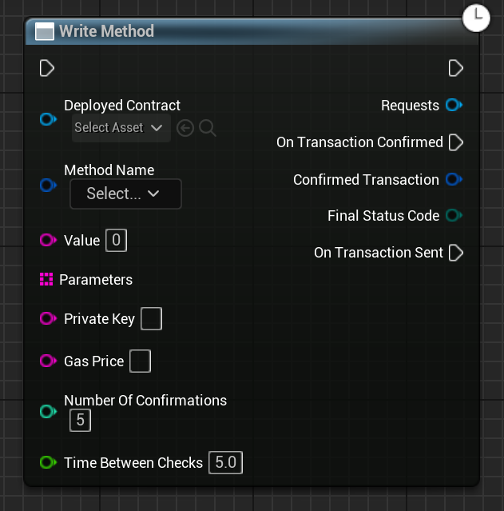

Calls a "write" method on the given contract. OnTransactionSent is executed when the transaction is sent by the connected wallet sucessfully; you must wait for OnTransactionConfirmed to return to use ConfirmedTransaction or FinalStatusCode (all error handling should be done after OnTransactionConfirmed).

# Inputs

| - | - | - |
|Type|Name|Description|
|UObject\*|WorldContextObject|The WorldContextObject for this function. This is mainly used for registering the async method with the GameInstance.|
|UEmergenceDeployment\*|DeployedContract|The deployed contract.|
|FEmergenceContractMethod|MethodName|The method to call.|
|FString|Value|The amount to transfer from sender to recipient (in Wei, or equivelent).|
|TArray<FString>|Parameters|The parameters to call the method with.|
|FString|PrivateKey|(Optional) The private key of the account to call the method with. Leave blank to call with the WalletConnect'd wallet / Futureverse custodial wallet.|
|FString|GasPrice|(Optional) The gas price to use if we're calling with a private key.|
|int|NumberOfConfirmations|The number of confirmations to wait for before deciding this transaction "confirmed".|
|float|TimeBetweenChecks|The amount of time between checks in seconds.|

# Outputs

| - | - | - |
|Type|Name|Description|
|FEmergenceTransaction|ConfirmedTransaction|The final transaction status data.|
|EErrorCode|FinalStatusCode|Any errors that occured trying to get the data.|

# C++
Module: `EmergenceBlockchainWallet`
include: `#include "WalletService/WriteMethod.h"`

`static UWriteMethod* WriteMethod(UObject* WorldContextObject, UEmergenceDeployment* DeployedContract, FEmergenceContractMethod MethodName, FString Value, TArray<FString> Parameters, FString PrivateKey, FString GasPrice, int NumberOfConfirmations = 5, float TimeBetweenChecks = 5.0F)` - instantiates this async method.
`Activate()` - Activates this async method.
In C++, the outputs of the async function can be acted upon by binding to the event delegate "`FOnTransactionConfirmed`".
You can also bind to `FOnTransactionSent`, for when the transaction was sent but not yet confirmed.

# Additional Information

This class or its parent class inherits from `UEmergenceCancelableAsyncBase`, and thefore also has the following functions that can be called on it:

`void Cancel()` - Cancels the requests.

`bool IsActive()` - Checks if the requests are in-flight.