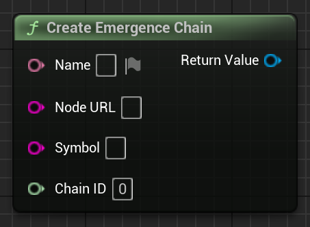

# CreateEmergenceChain

Creates a Emergence Blockchain object, which represents a single blockchain.

# Inputs

| - | - | - |
|Type|Name|Description|
|FText|Name|Name of the blockchain.|
|FString|NodeURL|RPC URL of the blockchain.|
|FString|Symbol|Symbol of the blockchain (for example ETH, or MATIC).|
|int64|ChainID|Chain ID of the blockchain.|

# Outputs

| - | - | - |
|Type|Name|Description|
|UEmergenceChain|return value|The created Emergence Chain|

# C++
Module: `EmergenceCore`
include: `#include "EmergenceChain.h"`

`UEmergenceChain::CreateEmergenceChain(FText _Name, FString _NodeURL, FString _Symbol, int64 _ChainID)` - Creates an Emergence Chain.
