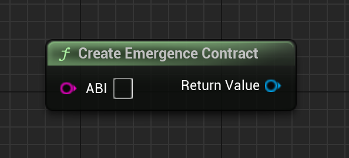

# CreateEmergenceContract

Creates a Emergence Contract object, which represents a contract ABI.

# Inputs

| - | - | - |
|Type|Name|Description|
|FString|ABI|The contract's ABI. You can find this as an output of the contract's compiler, or on websites such as Etherscan or Polygonscan if the contract's ABI was uploaded.|

# Outputs

| - | - | - |
|Type|Name|Description|
|UEmergenceContract|return value|The created Emergence Chain|

# C++
Module: `EmergenceCore`
include: `#include "Types/EmergenceContract.h"`

`UEmergenceContract::CreateEmergenceContract(FString _ABI)` - Creates an Emergence contract.
