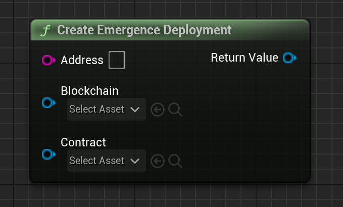

# CreateEmergenceDeployment

Creates a Emergence Deployed Contract object, which represents a contract on a chain.

# Inputs

| - | - | - |
|Type|Name|Description|
|FString|Address|The Address of the contract on the blockchain.|
|FString|UEmergenceChain|A blockchain object representing the blockchain that this contract resides on.|
|FString|UEmergenceContract|A contract object which contains the ABI of this contract.|

# Outputs

| - | - | - |
|Type|Name|Description|
|UEmergenceContract|return value|The created Emergence Deployed Contract|

# C++
Module: `EmergenceCore`
include: `#include "Types/EmergenceDeloyment.h"`

`UEmergenceDeployment::CreateEmergenceDeployment(FString _ABI)` - Creates an Emergence Deployed Contract.
