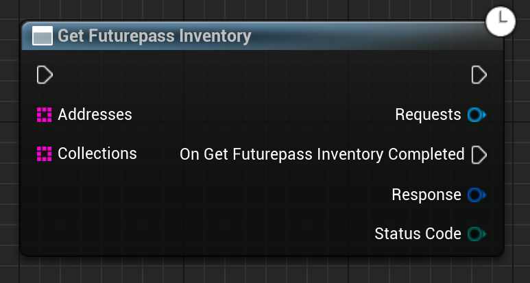

Gets the futurepass inventory of the given addresses, optionally filtered by the given collections. If no collections are provided, it returns all collections.

# Inputs

| - | - | - |
|Type|Name|Description|
|UObject\*|WorldContextObject|The WorldContextObject for this function. This is mainly used for registering the async method with the GameInstance.|
|TArray<FString>|Addresses|A list of addresses to get the futurepass inventory of - just the address, no blockchain information.|
|TArray<FString>|Collections|An optional list of collections to filter the inventory by - these should be in the format <chainID>:<chainType>:<Contract address>, e.g. "5:evm:0x1cac32d9893deca7769a2e64edc186163125d43b". If no collections are provided, it returns all collections.|

# Outputs

| - | - | - |
|Type|Name|Description|
|FEmergenceInventory|Response|An array of NFTs pulled from the FV asset registery, which match the query.|
|EErrorCode|StatusCode|Any errors that occured trying to get the data.|

# C++
Module: `EmergenceFutureverseAssetRegistry`
include: `#include "GetFuturepassInventory.h"`

`static UGetFuturepassInventory* UGetFuturepassInventory::GetFuturepassInventory(UObject* WorldContextObject, TArray<FString> Addresses, TArray<FString> Collections)` - instantiates this async method.
`Activate()` - Activates this async method.
In C++, the outputs of the async function can be acted upon by binding to the event delegate "`OnGetFuturepassInventoryCompleted`".

# Additional Information

This class or its parent class inherits from `UEmergenceCancelableAsyncBase`, and thefore also has the following functions that can be called on it:

`void Cancel()` - Cancels the requests.

`bool IsActive()` - Checks if the requests are in-flight.