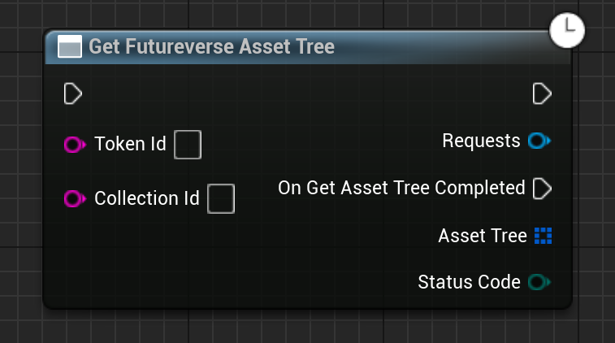

Gets the Asset Tree associated with a specific asset.

# Inputs

| - | - | - |
|Type|Name|Description|
|UObject\*|WorldContextObject|The WorldContextObject for this function. This is mainly used for registering the async method with the GameInstance.|
|FString|TokenId|The interger ID of the token you want to get the Asset Tree of. For example: "473" (without quotes).|
|FString|CollectionId|The collection ID of the token you want to get the asset tree of. For example: "7672:root:303204" (without quotes).|

# Outputs

| - | - | - |
|Type|Name|Description|
|const TArray<FFutureverseAssetTreePath>&|AssetTree|The returned array of AssetTree paths.|
|EErrorCode|StatusCode|Any errors that occured trying to get the data.|

# C++
Module: `EmergenceFutureverseAssetRegistry`
include: `#include "GetFutureverseAssetTree.h"`

`static UGetFutureverseAssetTree* GetFutureverseAssetTree(UObject* WorldContextObject, FString TokenId, FString CollectionId)` - instantiates this async method.
`Activate()` - Activates this async method.
In C++, the outputs of the async function can be acted upon by binding to the event delegate "`OnGetFutureverseAssetTreeCompleted`".

# Additional Information

This class or its parent class inherits from `UEmergenceCancelableAsyncBase`, and thefore also has the following functions that can be called on it:

`void Cancel()` - Cancels the requests.

`bool IsActive()` - Checks if the requests are in-flight.