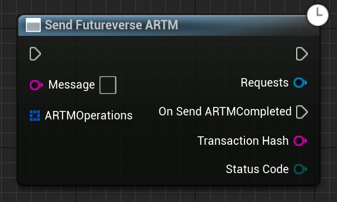

Sends an ARTM, including creating the ARTM message, sending it to the wallet to be signed, sending it to the ARTM endpoint and waiting for the transaction to succeed or fail.

# Inputs

| - | - | - |
|Type|Name|Description|
|UObject\*|WorldContextObject|The WorldContextObject for this function. This is mainly used for registering the async method with the GameInstance.|
|FString|Message|The message to include as part of the ARTM, tells the user what is happening.|
|TArray<FFutureverseARTMOperation>|ARTMOperations|The operations to perform as part of the ARTM, such as creating or deleting links.|

# Outputs

| - | - | - |
|Type|Name|Description|
|FString|TransactionHash|The Asset Registery Transaction's hash.|
|EErrorCode|StatusCode|Any errors that occured trying to get the data.|

# C++
Module: `EmergenceFutureverseAssetRegistry`
include: `#include "SendARTMAsync.h"`

`static USendFutureverseARTM* SendFutureverseARTM(UObject* WorldContextObject, FString Message, TArray<FFutureverseARTMOperation> ARTMOperations)` - instantiates this async method.
`Activate()` - Activates this async method.
In C++, the outputs of the async function can be acted upon by binding to the event delegate "`OnSendARTMCompleted`".

# Additional Information

This class or its parent class inherits from `UEmergenceCancelableAsyncBase`, and thefore also has the following functions that can be called on it:

`void Cancel()` - Cancels the requests.

`bool IsActive()` - Checks if the requests are in-flight.