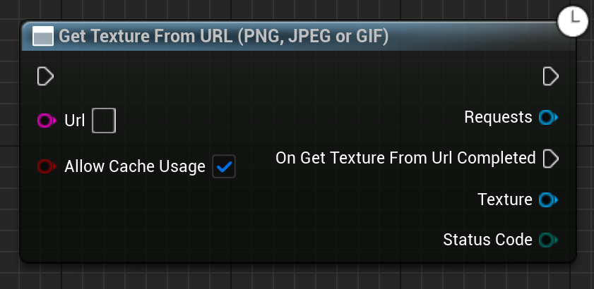

Takes a URL string and gets the PNG, JPEG or GIF from it. Will not work with anything other than PNGs, JPEGs or GIFs.

# Inputs

| - | - | - |
|Type|Name|Description|
|const FString&|Url|The Url to get data from. Can be HTTP or IPFS.|
|UObject\*|WorldContextObject|The WorldContextObject for this function. This is mainly used for Registering the async method with the GameInstance.|
|bool|AllowCacheUsage|If we should cache the image in memory, and if we should look in the cache before trying to pull it again.|

# Outputs

| - | - | - |
|Type|Name|Description|
|UTexture2D\*|Texture|The "Content" returned from this URL as a Texture2D.|
|EErrorCode|StatusCode|Any errors that occured trying to get the data.|

# C++
Module: `EmergenceHelperFunctions`
include: `#include "GetTextureFromUrl.h"`

`UGetTextureFromUrl::GetTextureFromUrl()` - instantiates this async method.
`Activate()` - Activates this async method.
In C++, the outputs of the async function can be acted upon by binding to the event delegate "`OnGetTextureFromUrlCompleted`".

# Additional Information

This class inherits from `UEmergenceCancelableAsyncBase`, and thefore also has the following functions that can be called on it:

`void Cancel()` - Cancels the requests.

`bool IsActive()` - Checks if the requests are in-flight.