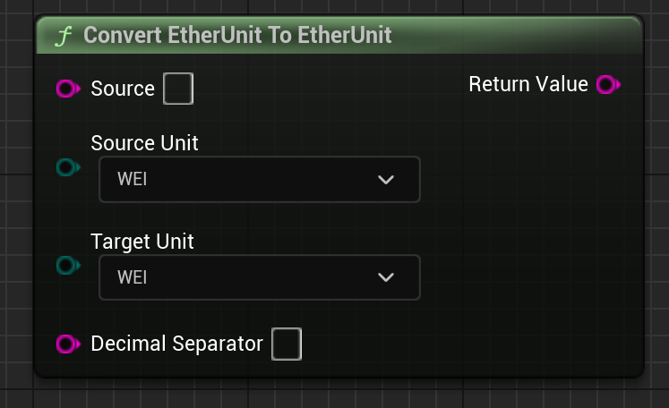

# Convert

Converts from one Eth unit to another.

## Inputs

| - | - | - |
|Type|Name|Description|
|const FString&|Source|The number to convert from|
|EEtherUnitType|sourceUnit|The number to convert from's units|
|EEtherUnitType|targetUnit|The number to convert to's units|
|const FString&|comaSeparator|What to use as a decimal seperator.|

## Outputs

| - | - | - |
|Type|Name|Description|
|FString|return value|The number converted to the target units|



# C++

Module: `EmergenceCore`
include: `#include "UnitConverterFunctionLibrary.h"`

```
FString UUnitConverterFunctionLibrary::Convert(const FString& source, EEtherUnitType sourceUnit, EEtherUnitType targetUnit, const FString& comaSeparator);
```
