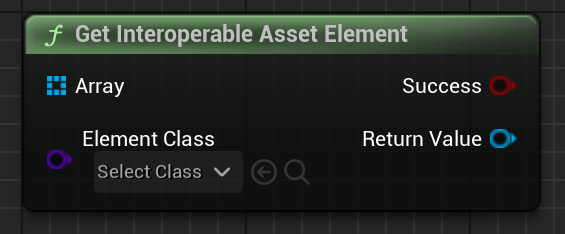

Given an array of Emergence IA Elements, find the one that matches a given Element class.

**Note: InteroperableAssets in the Emergence plugin are experimental and shouldn't yet be used in released game!**

# Inputs

| - | - | - |
|Type|Name|Description|
|TArray<UEmergenceInteroperableAssetElement\*>|Array|An array of Emergence IA Elements.|
|TSubclassOf<UEmergenceInteroperableAssetElement>|ElementClass|A class of Elements to find.|

# Outputs

| - | - | - |
|Type|Name|Description|
|bool&|Success|If a Element of the given class was found.|
|UEmergenceInteroperableAssetElement\*|Return Value|The Element that was found.|

# C++
Module: `EmergenceIAS`
include: `#include "InteroperableAssetLibrary.h"`

`static UEmergenceInteroperableAssetElement* GetInteroperableAssetElement(TArray<UEmergenceInteroperableAssetElement*> Array, UPARAM(meta = (AllowAbstract = false))TSubclassOf<UEmergenceInteroperableAssetElement> ElementClass, bool& success)`