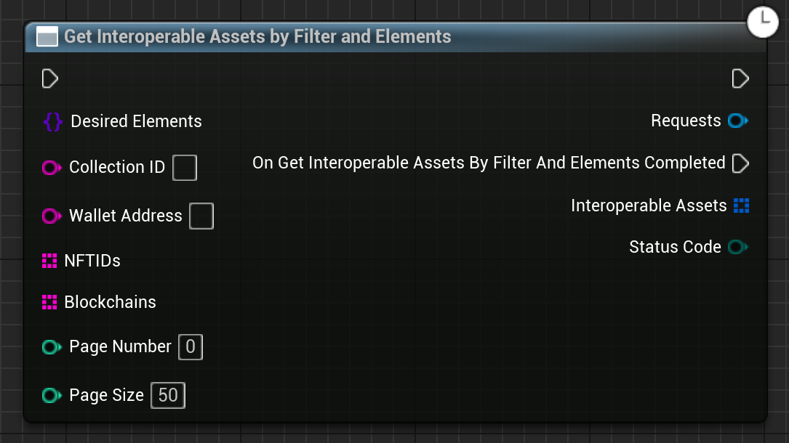

Gets IAs by one or many filters, and one or many IAS Elements.

# Inputs

| - | - | - |
|Type|Name|Description|
|UObject\*|WorldContextObject|The WorldContextObject for this function. This is mainly used for registering the async method with the GameInstance.|
|const TSet<TSubclassOf<class UEmergenceInteroperableAssetElement>>&|DesiredElements|A set of Emergence IAS Elements that should be included.|
|const FString&|CollectionID|A collection that the NFTs must be from.|
|const FString&|WalletAddress|A wallet address which all the NFTs must be owned by.|
|const TArray<FString>&|NFTIDs|An array of NFT IDs to include. They must be in the format CHAIN:Address:TokenId|
|const TArray<FString>&|Blockchains|A array of blockchains to include results from. Options are "ETHEREUM", "SEPOLIA".|
|const int|PageNumber|Which page number to get as part of pagination.|
|const int|PageSize|Size of the page to get. Default is 50.|

# Outputs

| - | - | - |
|Type|Name|Description|
|const TArray<FEmergenceInteroperableAsset>&|InteroperableAssets|An array of InteroperableAssets.|
|EErrorCode|StatusCode|Any errors that occured trying to get the data.|

# C++
Module: `EmergenceIAS`
include: `#include "GetInteroperableAssetsByFilterAndElements.h"`

`static UGetInteroperableAssetsByFilterAndElements* GetInteroperableAssetsByFilterAndElements(UObject* WorldContextObject,   const TSet<TSubclassOf<class UEmergenceInteroperableAssetElement>>& DesiredElements,   const FString& CollectionID,   const FString& WalletAddress,   const TArray<FString>& NFTIDs,   const TArray<FString>& Blockchains,   const int PageNumber = 0,  const int PageSize = 50)` - instantiates this async method.
`Activate()` - Activates this async method.
In C++, the outputs of the async function can be acted upon by binding to the event delegate "`OnGetInteroperableAssetsByFilterAndElementsCompleted`".

# Additional Information

This class or its parent class inherits from `UEmergenceCancelableAsyncBase`, and thefore also has the following functions that can be called on it:

`void Cancel()` - Cancels the requests.

`bool IsActive()` - Checks if the requests are in-flight.