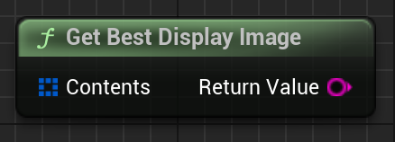

Given an EmergenceInventoryItemsMetaContent array, find the best image's URL. PNGs are best, then JPEGs, then GIFs (GIFs only on Windows). If nothing is found, returns an empty string.

# Inputs

| - | - | - |
|Type|Name|Description|
|TArray<FEmergenceInventoryItemsMetaContent>|Contents|This is usually retrieved from a Emergence Inventory Item's Metadata's Content array.|

# Outputs

| - | - | - |
|Type|Name|Description|
|FString|Return Value|The "best" image's URL.|

# C++
Module: `EmergenceInventory`
include: `#include "InventoryService/InventoryHelperLibrary.h"`

`static FString GetBestDisplayImage(TArray<FEmergenceInventoryItemsMetaContent> Contents)`