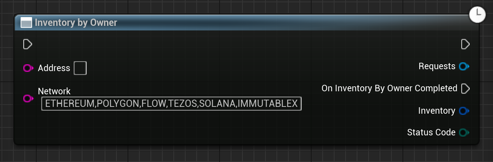

Gets the inventory (owned tokens) from a given address.

# Inputs

| - | - | - |
|Type|Name|Description|
|UObject\*|WorldContextObject|The WorldContextObject for this function. This is mainly used for registering the async method with the GameInstance.|
|const FString&|Address|Address to get the inventory from.|
|const FString&|Network|Comma seperated list of networks to get the inventory from. To get from all available, enter "ETHEREUM,POLYGON,FLOW,TEZOS,SOLANA,IMMUTABLEX".|

# Outputs

| - | - | - |
|Type|Name|Description|
|const FEmergenceAvatarData&|Avatar|This avatar's data.|
|EErrorCode|StatusCode|Any errors that occured trying to get the data.|

# C++
Module: `EmergenceInventory`
include: `#include "InventoryService/InventoryByOwner.h"`

`static UInventoryByOwner* InventoryByOwner(UObject* WorldContextObject, const FString& Address, const FString& Network)` - instantiates this async method.
`Activate()` - Activates this async method.
In C++, the outputs of the async function can be acted upon by binding to the event delegate "`OnInventoryByOwnerCompleted`".

# Additional Information

This class or its parent class inherits from `UEmergenceCancelableAsyncBase`, and thefore also has the following functions that can be called on it:

`void Cancel()` - Cancels the requests.

`bool IsActive()` - Checks if the requests are in-flight.