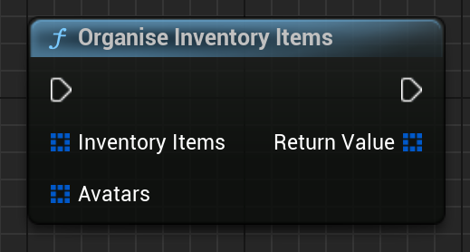

Given the output of InventoryByOwner and AvatarsByOwner, merge these outputs into an array of paired data about NFTs. 
So, if there is avatar data about an inventory object, these will be put into the same FEmergenceCombinedInventoryItem.
 
# Inputs

| - | - | - |
|Type|Name|Description|
|TArray<FEmergenceInventoryItem>|InventoryItems|Output of InventoryByOwner.|
|TArray<FEmergenceAvatarResult>|Avatars|Output of AvatarsByOwner.|

# Outputs

| - | - | - |
|Type|Name|Description|
|TArray<FEmergenceCombinedInventoryItem>|Return Value|The combined array.|

# C++
Module: `EmergenceInventory`
include: `#include "InventoryService/InventoryHelperLibrary.h"`

`static TArray<FEmergenceCombinedInventoryItem> OrganiseInventoryItems(TArray<FEmergenceInventoryItem> InventoryItems, TArray< FEmergenceAvatarResult> Avatars)`