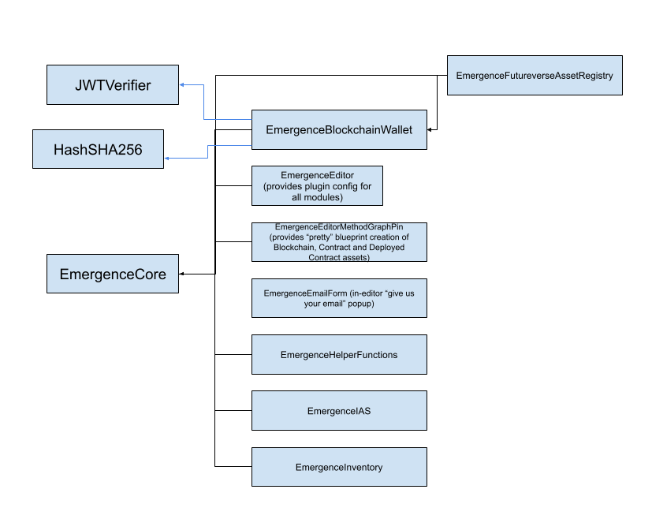

# APIs by Module

The Unreal plugin is split into modules. You can learn about the APIs each module provides below:

### [EmergenceCore](./EmergenceCore/EmergenceCore)

### [EmergenceBlockchainWallet](./EmergenceBlockchainWallet/EmergenceBlockchainWallet)

### [EmergenceHelperFunctions](./EmergenceHelperFunctions/EmergenceHelperFunctions)

### [EmergenceFutureverseAssetRegistry](./EmergenceFutureverseAssetRegistry/EmergenceFutureverseAssetRegistry)

### [EmergenceInventory](./EmergenceInventory/EmergenceInventory)

### [EmergenceIAS](./EmergenceIAS/EmergenceIAS)

Additionally, there are some modules that expose no API, some of which are dependencies of the above modules:

### EmergenceEditor

### EmergenceEmailForm

### HashSHA256

### JwtVerifier

### JwtCpp

## Module Dependency Map

Below is a diagram which describes which Emergence modules depend on other Emergence modules. Engine module dependencies aren't shown.

