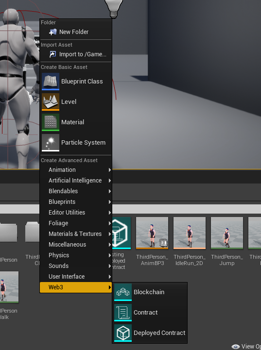
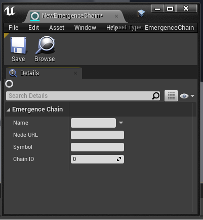
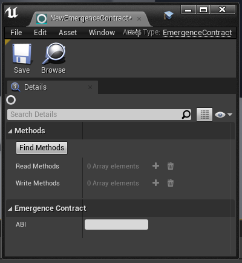
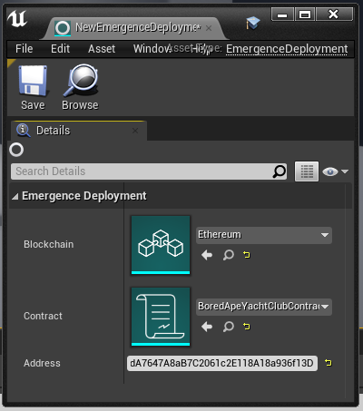

# Emergence Asset Types

The Emergence plugin introduced a number of new ways of managing information about blockchains and smart contracts. These take the form of game assets, which you can create similarly to how you would create a texture, material or blueprint. They can be found in the Add/Import menu (or right-clicking the background of the Content Browser):

There are three new types of asset under the "Web3" sub-menu: Blockchains, Contracts and Deployed Contracts.

## Blockchains

Emergence Blockchain assets are used by various methods and objects as a reference to a blockchain, including data about the blockchain and the node that connects to it.

## Contracts

Emergence Contract assets are used by various methods and objects as a descriptor of a contract's programming interface. Much of its data comes from the contract's ABI.

## Deployed Contract

Emergence Deployed Contract assets are used by various methods and objects as a reference to a specific contract deployed on-chain. It is made from a Blockchain asset, a Contract asset and an address.

