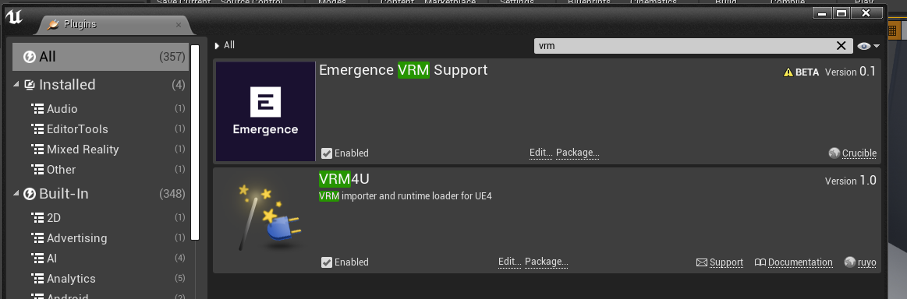
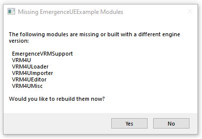
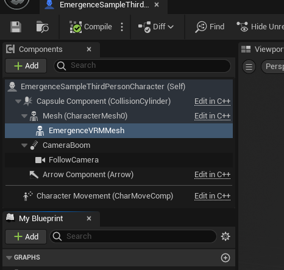
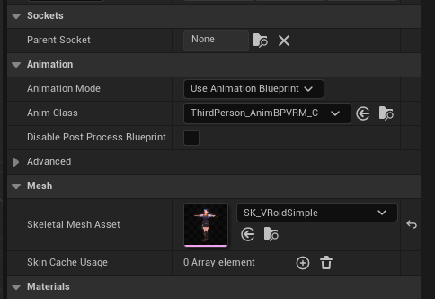
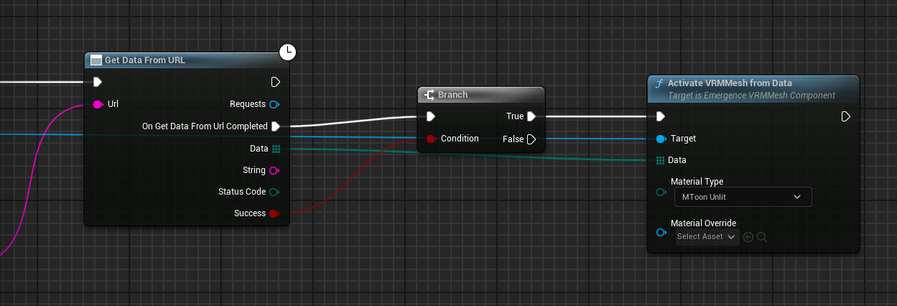

# EmergenceVRMSupport Plugin

The EmergenceVRMSupport is a plugin that acts as a wrapper around another plugin called "VRM4U" to simplify loading of a VRM. It is provided as a seperate plugin for technical reasons, we plan to eventually merge it into the main Emergence plugin in the future.

## Getting EmergenceVRMSupport and VRM4U

Currently, the EmergenceVRMSupport plugin is obtainable via our [Github](https://github.com/CrucibleNetworksLtd/EmergenceSDKUnreal/releases). The special version of VRM4U that Emergence is compatible with is distrobuted along-side each release of the plugin, however if you wish to see what the changes we make to the VRM4U plugin are, you can find those in [our fork of it here](https://github.com/CrucibleNetworksLtd/VRM4U).

## Enabling VRM4U and the Emergence VRM Support

Then, open your Unreal Engine project and go to the plugin configuration window. From here, enable the “VRM4U” plugin and the “Emergence VRM Support” plugin and then restart the editor.

When you restart, you will be asked if you want to rebuild a number of unbuilt modules - click “Yes”. Do not be concerned if this takes a while, there is a lot of code to compile!

## Creating a skeleton compatible with VRM4U

**INSERT INSTRUCTIONS FOR UE5 HERE**

## Character Setup

Next, you’ll need to set up a character to receive the animations. The way this works with VRM4U (and our extra simplification / integration code) is kinda odd so make sure to read each step carefully.

Effectively, you’re going to have a hidden mesh that actually does all of the animating, and then an additional visible mesh which will have the player’s VRM avatar loaded onto it at runtime which will copy the hidden mesh - weird, right?

For this example, the default character skeletal mesh is going to act as our visible mesh, and we’re going to attach to this a child “EmergenceVRMMesh” component. It must be the child of the skeleton it's going to be copied by, as the component looks to its parent to find this skeleton.

You want to click on the EmergenceVRMMesh and set the Anim Class to the class you created in the last section, and Skeletal Mesh to the SK_VRoidSimple:

Remember, the location or rotation of this mesh shouldn’t matter as it won’t be visible.

## Getting the URL of a VRM

You can use [AvatarByOwner](./Unreal/APIs/EmergenceInventory/AvatarByOwner) or [GetInteroperableAssetsByFilterAndElements](./EmergenceIAS/GetInteroperableAssetsByFilterAndElements) to get details (such as the URL) of player's owned VRMs.

## Loading the VRM from a URL

Now that you have the components set-up and the URL of the model, all thats left to do is load the model. The Avatar's files will be downloaded via the "GetDataFromURL" node. This can take a few moments, as files can be rather large. So expect a few moments before the Avatar is ready and loaded in your game!

Congratulations, you have avatars loading!